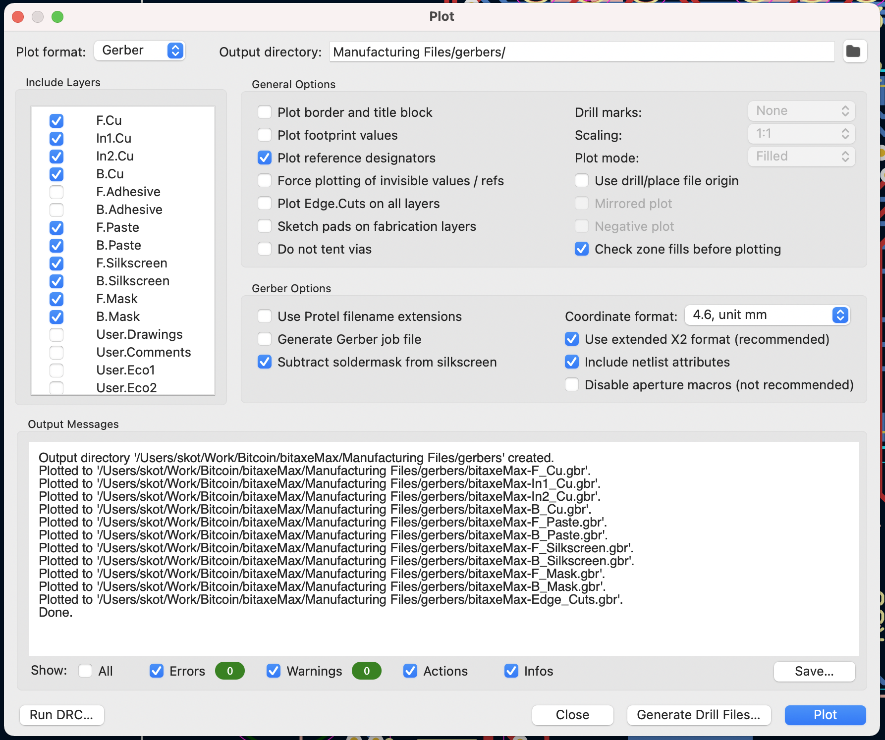
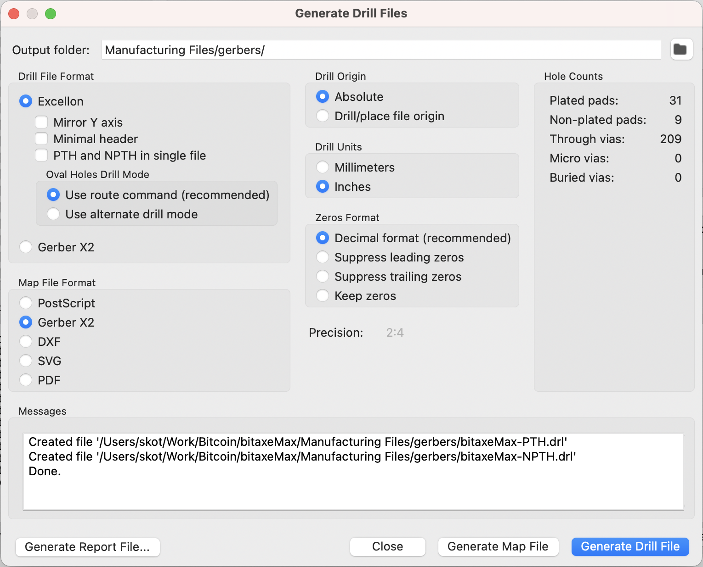

# Building PCBs

In order to get PCBs made, you usually need to provide them with the following files;

- Gerbers
- Drill Files

Additionally if you want to have a shop assemble the boards for you, you’ll also need to provide;

- Bill of Materials (BOM)
- Centroid file (XY)

### Generating Gerbers and Drill Files

Gerbers are a set of files in a standard format that allow a PCB manufacturer to build the PCB. Usually there is one gerber file for each layer of a PCB. A Gerber file can represent a wide variety of different layer types;

- Copper layer
- Silkscreen Layer
- Soldermask layer
- Board outline
- Drills (Okay, this is actually not a gerber, but your PCB house will definitely need it)

Any* PCB CAD software will allow you to generate gerbers. We use [KiCad](https://www.kicad.org) because it is open source, free, and *awesome*. Here is how to generate gerbers in KiCad v6;

1. Open up the design in KiCad and switch to the PCB board editor view (ie not the schematic). Some people call this pcbnew.
2. Choose File → Fabrication Outputs → Gerbers (.gbr)…
3. Pick the right options for what your PCB board house expects. Here is what I use;

Make sure you have these “Include Layers” checked;

- **F.Cu** → Front copper
- **In1.Cu** → Inner layer 1 Copper
- **In2.Cu** → Inner layer 2 Copper
- **B.Cu** → Back copper
- **F.Paste** → Front Paste. Note: this is used to make a solder paste stencil. This is optional. Many PCB houses will let you order stencils as a separate step. use these gerbers for ordering a stencil
- **B.Paste** → Back paste. see note above
- **F.Silkscreen** → Front Silkscreen. sometimes this is called the Legend
- **B.Silkscreen** → Back Silkscreen. sometimes this is called the Legend of Zelda
- **F.Mask** → Front soldermask
- **B.Mask** → Back soldermask
- **Edge.Cuts** → The board outline. This defines the shape the PCB is cut to.

1. Next you’ll want to generate the drill files. Click that button in the lower right corner of the “Plot” screen from above.
2. Generate the drill files according to your PCB house specs. Here are the options I use;

That’s it! Take all of those generated files and give them to your PCB house. If you’re ordering stencils (which you should!), pull out `-F_Paste.gbr` and `-B_Paste.gbr` and send those to the right place. Paste gerbers are not needed to manufacture a PCB.

### Generating PCBA Manufacturing files

- TBD
