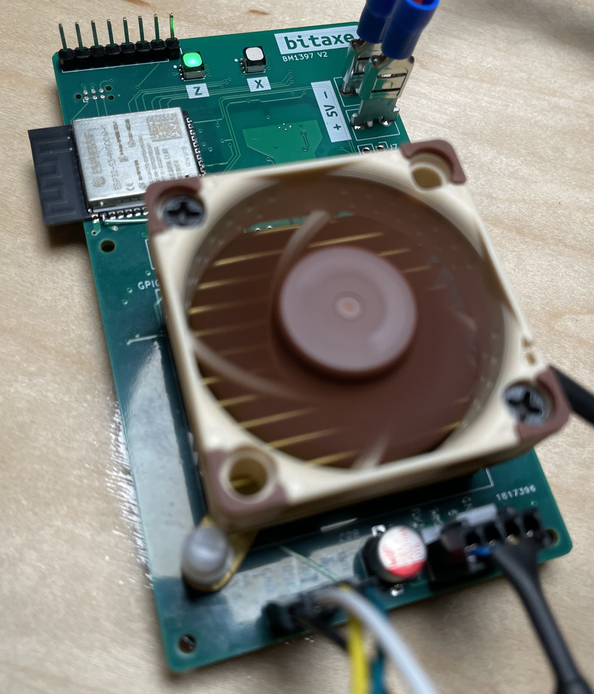
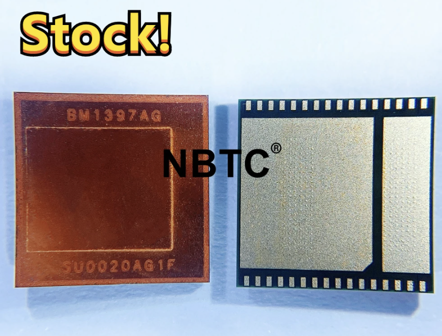
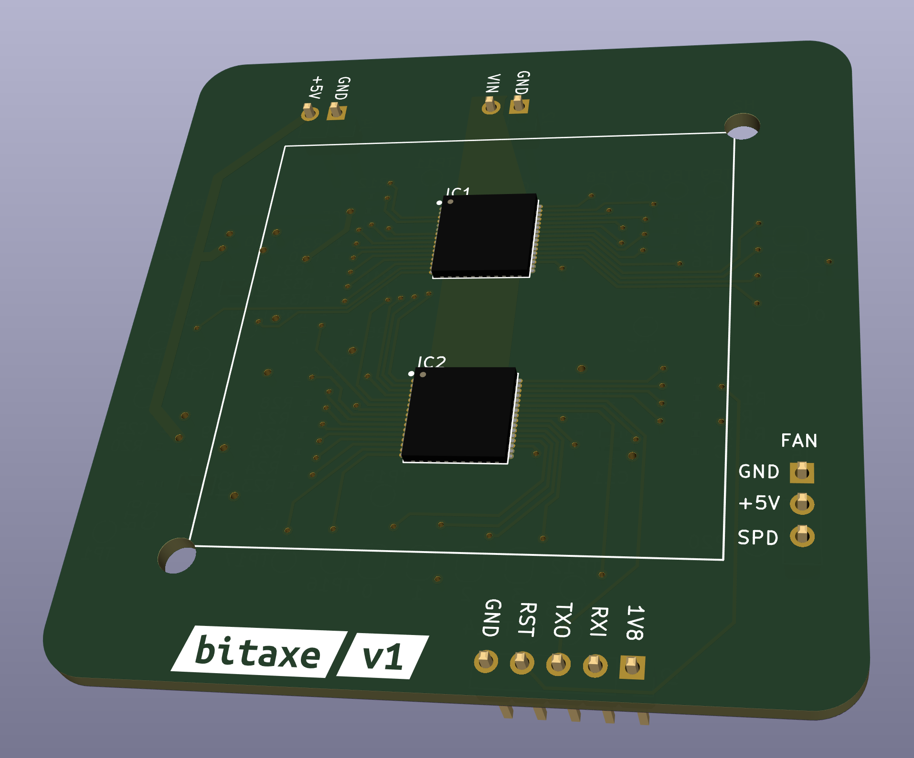

# The bitaxe
bitaxe is the first fully open source hardware Bitcoin ASIC miner.

## Goals
- **Standalone**: can mine directly to your pool over WiFi. No External computer needed.
- **Embedded**: low cost, low maintenance, high availability, high reliability, low power.
- **ASIC**: based on the very efficient BM1397 from Bitmain.
- **Versatile**: solo/pool mining, autotune power/heat/efficiency.
- **Open Source**: All design files are provided.

## Features
- **ESP32-S3-WROOM-1** wifi microcontroller on board
- **TI TPS40305** buck regulator steps down the 5V input to power the BM1397
- **Maxim DS4432U+** current DAC digitally adjusts the BM1397 core voltage from 0.04V to 2.4V
- **TI INA260** power meter measures the input voltage and current of the miner
- **Microchip EMC2101** measures the BM1397 internal diode temperature. Also PWM controls the fan and monitors tach output.
- Two **sweet** RGB status LEDs

## BM1397

- The BM1397 is a undocumented SHA256 mining ASIC from Bitmain. It's mostly used in the Antminer S17 and T17
- Bitmain claims the BM1397 has 0.03J/GH efficiency
- The BM1397 is available (new) for around $20 each and (used) for around $6 ea in small quantities.
- Choose your BM1397 version: [Guide here](https://d-central.tech/bm1397-ad-ag-ah-ai-antminer-17-series-chip-replacement-guide/)
- The BM1397 has the same footprint as the BM1387, but a very different pinout.
    - It also has two "Modes" that change some of the signal pins around to make chaining easy
- The BM1397 is driven by an undocumented protocol over UART. Baudrate is 115200bps by default but can go up to 6Mbps in order to provide mining jobs quickly enough to the ASIC daisy-chain.

## Current Status
- The hardware has been built and tested.
- Using cgminer on a separate computer, the bitaxe can mine in excess of 400 GH/s
- ESP32 miner firmware is still underdevelopment.

## Hardware
- [BM1397 from random AliExpress seller](https://www.aliexpress.com/item/3256802274958527.html). I got the "AG" variant. Not really sure what the difference is.
- [40x40mm heatsink and 5V fan](https://www.aliexpress.com/item/2251832861666365.html) from a random AliExpress seller. At least half of these arrived broken in some way. But they are cheap and the working ones do keep the BM1387's nice and cool when used with some thermal compound.
    - Swap this fan with the [Noctua NF-A4x10](https://noctua.at/en/products/fan/nf-a4x10-pwm) 5V 4-Pin fan for a much more pleasant experience.
- The BM1397 serial port is 1.8V. These pins are broken out, but the main idea is to communicate with the BM1397 from the ESP32
- Level shifters to interface the 1.8V BM1397 with the 3.3V ESP32. These pins are also broken out.
- [KiCad 6](https://www.kicad.org) design files
- All of the parts on the board are listed in the KiCad BOM

## Software
- [ESP-Miner](https://github.com/skot/ESP-Miner) firmware in progress.

## Power Supply Requirements
- [5VDC Power supply](https://www.amazon.com/BTF-LIGHTING-Plastic-Adapter-Transformer-WS2812B/dp/B01D8FM4N4). Should be capable of over 15W
    - Needs to connect with [spade-style connectors](https://www.amazon.com/gp/product/B01G4POUAU)

### ESP32 Programming Requirements
- [ESP-Prog](https://www.digikey.com/en/products/detail/espressif-systems/ESP-PROG/10259352) ESP32 Programmer
- [TC2030-IDC-NL](https://www.tag-connect.com/product/tc2030-idc-nl) Tag Connect Cable
- [TC2030-CLIP](https://www.tag-connect.com/product/tc2030-retaining-clip-board-3-pack)

## Connections

### Power Input
| Pin Name     | Description |
| ----------- | ----------- |
| +5V      | Main input. This should be 5V, 15W       |
| GND      | Main input ground      |

## Building
- Check out [building.md](building.md) for PCB ordering tips
- Check out [assembly.md](assembly.md) for assembly tips
